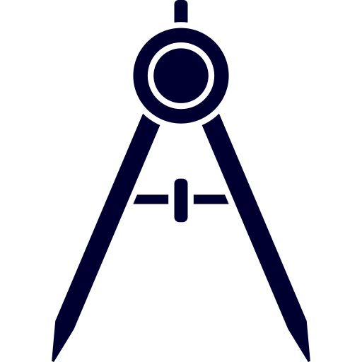

[](https://www.python.org/downloads/)
[](https://github.com/psf/black)
[](https://pre-commit.com/)
[](https://github.com/spacesys-finch/payload-designer)
[](https://github.com/spacesys-finch/payload-designer)

[](https://github.com/spacesys-finch/payload-designer/actions/workflows/pytest.yml)
[](https://codecov.io/gh/spacesys-finch/payload-designer)




# Payload Designer
A design tool for the FINCH Eye payload.

Built by the [University of Toronto Aerospace Team](https://www.utat.ca/space-systems) :milky_way:.


# Contribution
## Setup
This section will take you through the procedure to configure your development environment. At a glance:
1. Install project's python version
1. Install git
1. Install poetry
1. Clone repository
1. Run poetry install
1. Configure IDE virtual environment
1. Install pre-commit hooks

Begin by installing the project's python version. See the badges at the top of the README for the version number.

If not already installed, install [git](https://git-scm.com/).

The repo employs [poetry](https://python-poetry.org/)  as its dependency and environment manager. Poetry can be installed through the Windows Powershell via:
```
(Invoke-WebRequest -Uri https://raw.githubusercontent.com/python-poetry/poetry/master/install-poetry.py -UseBasicParsing).Content | python -
```

And on Linux or macOS with:

```
curl -sSL https://raw.githubusercontent.com/python-poetry/poetry/master/install-poetry.py | python3 -
```

The output will include the following line. Ensure that the filepath in brackets (the one in your PowerShell/terminal) has been [added to your Windows PATH](https://helpdeskgeek.com/windows-10/add-windows-path-environment-variable/) or [Linux/macOS PATH](https://stackoverflow.com/a/19663996): 

```
To get started you need Poetry's bin directory (C:\Users\WDAGUtilityAccount\AppData\Roaming\Python\Scripts) in your `PATH`
environment variable.
```

Clone the repo using [Github Desktop](https://desktop.github.com/)  or the commandline via:

```
git clone https://github.com/spacesys-finch/payload-designer.git
```

From within the cloned repo, run poetry's install command to install all the dependencies in one go:
```
poetry install
```

Configure your IDE to use the virtual environment poetry has created at `C:\Users\<USERNAME>\AppData\Local\pypoetry\Cache\virtualenvs` (you can also find it with the command `poetry show -v`). In the case of [VSCode](https://code.visualstudio.com/) , enter the command pallet by going to `View>Command Palette` and search for `Python:Select Interpreter`. Select the appropriate poetry virtual environment for the repo (usually includes a long jumbled name in brackets). Restart VSCode if you do not see it listed. Once the intepreter is changed, restart your terminal by [deleting the old one](https://code.visualstudio.com/docs/editor/integrated-terminal#_managing-terminals) and launching it again.

Install the pre-commit script and hooks using:
```
pre-commit install --install-hooks
```

You're now ready to start contributing!

## Adding Packages
To add a new package to the poetry virtual environment, install it via:
```
poetry add <package>
```
This is poetry's version of `pip install <package>`.

## Testing
This repo uses [pytest](https://docs.pytest.org/en/6.2.x/) for unit testing. To run all unit tests, call:

```
pytest -v
```

If this command did not work, the IDE did not launch a terminal with the virtual environment loaded. Before launching any commands, enter the environment with:

```
poetry shell
```

You can find an interactive report of test results in `./logs/pytest/pytest-report.html`. Individual tests can also be specified as follows:
```
pytest tests/test_<filename>.py::<function name>
```

Groups of tests can be run using markers. Assign a marker decorator to the group of functions you want to test like this:

```
@pytest.mark.foo
def my_test_function():
    # some test
```

To use the custom marker `foo`, it must be added to the list of custom pytest markers in `pyproject.toml>[tool.pytest.ini_options]>markers`. The tests marked with `foo` can then be run by calling:
```
pytest -v -m foo
```

Or to avoid all tests with a particular marker, call:
```
pytest -v -m "not foo"
```


## Commits
### Pre-Commit
This repo is configured to use [pre-commit](https://pre-commit.com/) hooks. The pre-commit pipeline is as follows:

1. [Isort](https://pycqa.github.io/isort/): Sorts imports, so you don't have to.
1. [Black](https://black.readthedocs.io/en/stable/): The uncompromising code autoformatter.
1. [Docformatter](https://github.com/myint/docformatter): A docstring autoformatter.
1. [Pylint](https://github.com/pycqa/pylint): It's not just a linter that annoys you!

Pre-commit will run the hooks on commit, but when a hook fails, they can be run manually to delint using:

```
pre-commit run --all-files
```

### Branches
To improve the organization of this repository and reduce conflicts, branches will be organized as follow:
1. `main`: the branch containing the most recent working release. All code in this branch should run perfectly without any known errors.
1. `dev`: branched off of `main`; the most updated version of the project with the newest features and bug fixes.
1. `features/<feature-name>`: branched off of `dev`; a feature branch. **Features must be tested thoroughly before being merged into dev**

## Issues
You can create a new task (issue) as follows:
1. Navigate to the "Projects" tab
1. Create a new task in the "To Do" column
1. Click on the three dots in the top right corner of the card and select "Convert to issue"
1. \[Optional\] Assign yourself or somebody else to the issue
1. \[Optional\] Add the issue to a milestone (useful for breaking a large task into smaller tickets)

## Taking on Tickets
1. Select your issue (either on Projects board or through the "Issues" tab)
1. Change the status of the issue to "In Progress" (either slide the card to the "In Progress" column in the Projects board, or change the status on the issue's page)
1. Create a new branch of the form `feature/<feature-name>`, do some ✨ m a g i c ✨, and create a Pull Request (**make sure you assign our Project board to the PR**)
1. Request a teammate for code review, and link your PR to its respective issue
1. If all goes well, merge it in!


